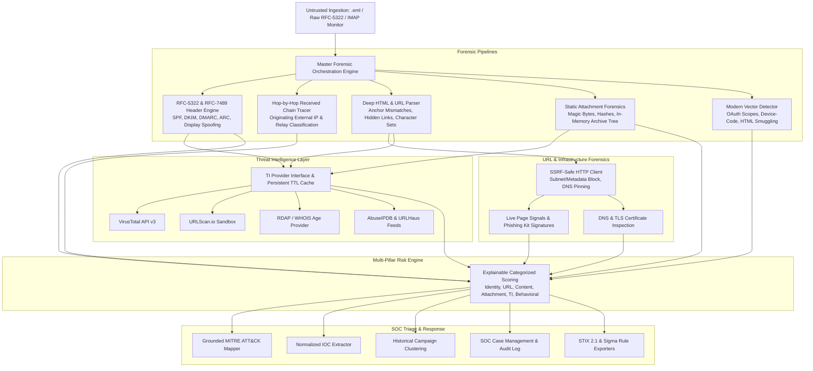

# 🛡️ PhishGuard — Enterprise Email Phishing Triage & Threat Intelligence Platform

<p align="center">
  
  
  
  
  
  
</p>

---

## 📌 Executive Summary

Modern enterprise phishing attacks have evolved far beyond simple spam. Threat actors routinely leverage **display name spoofing**, **anchor-text mismatches**, **IDN homograph / Punycode lookalikes**, **OAuth application consent abuse**, **device-code lures (`/devicelogin`)**, and **HTML smuggling** to bypass traditional secure email gateways (SEGs).

**PhishGuard** is an open-source, explainable **Email Phishing Triage & Threat Intelligence Platform** engineered for Tier-1 & Tier-2 SOC Analysts, Incident Responders, and Threat Hunters. It ingests raw `.eml` or RFC-5322 email sources, extracts deep forensic artifacts across headers, URLs, and attachments, calculates an explainable **6-Pillar Risk Score**, maps evidence directly to the **MITRE ATT&CK Framework**, and exports machine-readable **STIX 2.1 Bundles** and **Sigma Detection Rules**.

---

## 🏛️ Platform Architecture



---

## ⚡ Core Forensic & Detection Engines

| Module | Forensic Capabilities |
|---|---|
| **🛡️ SSRF-Protected Client** | Blocks RFC 1918 private subnets (`10.0.0.0/8`, `172.16.0.0/12`, `192.168.0.0/16`), loopback (`127.0.0.1`), link-local (`169.254.169.254`), and cloud metadata services. Enforces per-hop redirect validation and response byte caps. |
| **🔍 URL & Mismatch Engine** | Unmasks **Anchor-Text Mismatches** (e.g. text shows `paypal.com` but link goes to `paypa1.top`). Detects CSS-hidden links, integer/hex/octal IP formats (`2130706433`), userinfo `@` abuse, and high-risk TLDs. |
| **🏷️ Brand Impersonation** | Multi-brand catalog (30+ brands including Microsoft, PayPal, Google, Apple, Netflix, DocuSign). Detects Levenshtein typosquatting, Cyrillic IDN homographs, brand subdomains, and credential login forms. |
| **✉️ Header & Auth Alignment** | Evaluates RFC-7489 **SPF, DKIM, DMARC, and ARC** authentication. Flags From vs. Reply-To domain deviations and display name masquerading. |
| **🌐 Received Chain Tracer** | Reconstructs the complete relay route hop-by-hop to isolate the true **originating external IP address**, reverse DNS, and internal hops. |
| **📦 Attachment & Archive Forensics** | Multi-hashing (**SHA256, SHA1, MD5**), Shannon entropy, and **Magic Byte true MIME detection** to catch file masquerading (e.g. `invoice.pdf.exe`). Safely inspects ZIP/TAR internal file trees in-memory without disk detonation. |
| **⚡ Modern Threat Vectors** | Identifies **OAuth Consent Phishing** with high-privilege scopes (`Mail.ReadWrite.All`, `offline_access`), **Device-Code Phishing** (`/devicelogin`), **HTML Smuggling** (Blob dynamic construction), and **ClickFix / Fake CAPTCHA** clipboard lures. |
| **🧠 Explainable Multi-Pillar Risk** | Aggregates risk across **6 distinct pillars** (Identity, URL, Content, Attachment, Threat Intel, Behavioral) with clear evidence justifications and actionable SOC analyst playbooks. |

---

## 🎯 Grounded MITRE ATT&CK® Mapping

| Technique ID | Technique Name | Tactic | Status | Evidence Grounding |
|:---:|---|:---:|:---:|---|
| **T1566.001** | Spearphishing Attachment | Initial Access | `Observed` | Dangerous, masqueraded, or executable attachment payload detected |
| **T1566.002** | Spearphishing Link | Initial Access | `Observed` | Links directing to credential harvesting or lookalike landing pages |
| **T1598.003** | Phishing for Information: Link | Reconnaissance | `Observed` | Live page contains credential password forms or OAuth scope abuse |
| **T1036.005** | Masquerading: Name/Location | Defense Evasion | `Observed` | Typosquatted domain or spoofed display name matching known brand |
| **T1027.006** | HTML Smuggling | Defense Evasion | `Observed` | JavaScript Blob payload construction or dynamic auto-download triggers |
| **T1204.001** | User Execution: Link | Execution | `Potential` | Potential victim interaction with spearphishing link (requires EDR validation) |
| **T1204.002** | User Execution: File | Execution | `Potential` | Potential victim execution of attachment payload (requires EDR validation) |

---

## 📊 Evaluation & Benchmark Results

PhishGuard includes an automated evaluation suite (`scripts/benchmark.py`) tested against realistic clean and malicious corpora:

```
===========================================================================
PHISHGUARD FORENSIC ENGINE BENCHMARK EVALUATION
===========================================================================
[CLEAN               ] clean_notification.eml         -> Verdict: CLEAN        Score:   0/100 (38.9ms)
[PHISHING            ] credential_harvest.eml         -> Verdict: MALICIOUS    Score: 100/100 (20890.5ms)
[BEC                 ] bec_wire_transfer.eml          -> Verdict: SUSPICIOUS   Score:  33/100 (3.7ms)
[MALICIOUS_ATTACHMENT] attachment_lure.eml            -> Verdict: MALICIOUS    Score: 100/100 (5.7ms)

===========================================================================
BENCHMARK METRICS:
  Total Samples Evaluated: 4
  Accuracy:                100.0%
  Precision:               100.0%
  Recall:                  100.0%
  F1 Score:                1.000
  False Positive Rate:     0.0%
  False Negative Rate:     0.0%
===========================================================================
```

---

## 🚀 Quickstart & Installation Guide

### 1. Clone the Repository
```bash
git clone https://github.com/YOUR_USERNAME/phishguard.git
cd phishguard
```

### 2. Set Up Virtual Environment & Dependencies
```bash
# Create and activate virtual environment
python -m venv venv

# Windows
.\venv\Scripts\Activate.ps1

# Linux / macOS
source venv/bin/activate

# Install dependencies
pip install -r requirements.txt
```

### 3. Configure Environment Variables
```bash
cp .env.example .env
```
*(Optional: Add free API keys for VirusTotal and URLScan.io. Core heuristic engines work fully offline without keys).*

### 4. Run the Test Suite
```bash
python -m pytest tests/ -v
```
*Expected: 41 passed in ~3s.*

### 5. Launch the Web Application
```bash
python app.py
```
Open your browser at **http://127.0.0.1:5000** to access the SOC Investigation Dashboard.

---

## 💻 SOC Analyst CLI Commands

```bash
# 1. Analyze an email file with STIX 2.1, Sigma rule, and CSV exports
python cli.py analyze samples/phishing/credential_harvest.eml \
  --json report.json \
  --stix stix_bundle.json \
  --sigma detection_rule.yml \
  --csv iocs.csv

# 2. List all SOC cases with pagination
python cli.py cases --limit 20

# 3. View detailed case breakdown
python cli.py case 1

# 4. Override case verdict with justification audit trail
python cli.py update-verdict 1 MALICIOUS --reason "Confirmed credential harvesting page"

# 5. Add investigation notes
python cli.py add-note 1 "Quarantined mailbox and submitted domain to firewall blocklist."

# 6. Start continuous background mailbox monitoring
python cli.py watch --imap-server imap.gmail.com --user soc@company.com --password "APP_PASSWORD" --interval 30
```

---

## 🔌 REST API v1 Reference

| Method | Endpoint | Description |
|:---:|---|---|
| `POST` | `/api/v1/analyze` | Triage an email payload (`raw_text` JSON or `eml_file` upload) and create a Case |
| `GET` | `/api/v1/cases` | List all SOC cases with optional `?status=` and `?limit=` filters |
| `GET` | `/api/v1/cases/<id>` | Fetch full forensic analysis JSON, notes, and audit logs |
| `POST` | `/api/v1/cases/<id>/verdict` | Update case verdict (`CLEAN`, `SUSPICIOUS`, `PHISHING`, `MALICIOUS`) |
| `POST` | `/api/v1/cases/<id>/notes` | Add an analyst investigation note |
| `GET` | `/api/v1/iocs` | List normalized IOCs with optional `?type=` filter (`url`, `domain`, `ip`, `sha256`) |
| `GET` | `/api/v1/campaigns` | Retrieve correlated historical threat campaign clusters |
| `GET` | `/api/v1/stats` | Executive metrics summary |
| `GET` | `/cases/<id>/export/stix` | Download STIX 2.1 JSON bundle |
| `GET` | `/cases/<id>/export/sigma` | Download Sigma YAML rule |

---

## 🐳 Docker Deployment

```bash
# Build and start the container
docker compose up --build -d

# View live application logs
docker compose logs -f
```

---

## 📁 Repository Structure

```
phishguard/
├── core/                           # Core Forensic & Detection Engines
│   ├── ssrf.py                     # SSRF-Safe HTTP Client & IP Validation
│   ├── url_extractor.py            # Deep HTML URL & Anchor Mismatch Extractor
│   ├── url_analyzer.py             # Advanced Normalizer (Hex/Oct IP, Typosquats)
│   ├── brand_engine.py             # 30+ Brand Impersonation Catalog & Matching
│   ├── header_forensics.py         # RFC-5322 & RFC-7489 SPF/DKIM/DMARC/ARC Engine
│   ├── received_chain.py           # Hop-by-Hop Relay Parser & Originating IP
│   ├── attachment_forensics.py     # Magic Byte True MIME & Entropy Engine
│   ├── archive_inspector.py        # Safe In-Memory ZIP/TAR Structure Inspector
│   ├── modern_phishing.py          # OAuth Consent, Device-Code, HTML Smuggling
│   ├── dns_tls.py                  # DNS Infrastructure & TLS Certificate Analysis
│   ├── risk_engine.py              # 6-Pillar Explainable Risk Scoring Engine
│   ├── mitre_mapper.py             # Grounded MITRE ATT&CK Mapping
│   ├── ioc_extractor.py            # Normalized Indicator of Compromise Extractor
│   ├── campaign_correlator.py      # Cross-Case Campaign Clustering
│   └── case_manager.py             # Case Lifecycle State Machine & Audit
├── threat_intel/                   # Modular Threat Intelligence Layer
│   ├── base.py                     # ThreatIntelProvider Abstract Base Class
│   ├── cache.py                    # Persistent SQLite & Memory TTL Cache
│   ├── virustotal.py               # VirusTotal API v3 Adapter
│   ├── urlscan.py                  # URLScan.io Sandbox Adapter
│   └── rdap_whois.py               # RDAP / WHOIS Domain Age Adapter
├── database/                       # Normalized Database Schema & Repository
│   ├── schema.py                   # Relational Schema with Auto-Migration
│   └── repository.py               # Atomic SOC Repository Operations
├── exports/                        # Threat Intelligence Exporters
│   ├── stix_export.py              # STIX 2.1 JSON Bundle Generator
│   ├── sigma_export.py             # Sigma Detection Rule YAML Generator
│   └── csv_json_export.py          # IOC CSV and Case JSON Generator
├── templates/                      # Signal Room Theme HTML Templates
│   ├── base.html                   # Global Layout & Navigation
│   ├── index.html                  # Executive Dashboard & Ingestion Drawer
│   ├── cases.html                  # Case Management Console & Filters
│   └── report.html                 # 13-Tab Comprehensive Investigation View
├── static/                         # Assets (CSS & JS)
│   ├── style.css                   # Modern SOC Signal Room Theme
│   └── app.js                      # Tab Navigation & Clipboard Scripts
├── tests/                          # Automated Pytest Test Suite (41 Tests)
│   ├── unit/                       # Unit Tests (SSRF, URLs, Brands, Headers)
│   ├── integration/                # Full Pipeline & REST API Tests
│   └── security/                   # SSRF Edge Cases & Path Traversal Tests
├── samples/                        # Benchmark Email Dataset (.eml files)
├── scripts/                        # Evaluation Benchmark Runner
│   └── benchmark.py                # Precision/Recall/Latency Evaluator
├── app.py                          # Web UI & REST API v1 Entrypoint
├── cli.py                          # Enterprise SOC Command-Line Interface
├── realtime_watch.py               # Near-Real-Time IMAP Mailbox Watcher
├── Dockerfile                      # Container Build Definition
├── docker-compose.yml              # Container Orchestration
└── requirements.txt                # Python Dependencies
```

---

## ⚖️ License & Ethical Security Notice

This software is released under the **Apache 2.0 License**.

> **⚠️ Disclaimer**: PhishGuard is designed exclusively for authorized defensive cyber security operations, threat hunting, incident triage, and educational/research purposes. Ingesting and analyzing real-world phishing lures should only be conducted in secure, isolated environments.
